## Изучите [README.md](README.md) файл и структуру проекта.

## Задание 1

Cinema Abyss - Диаграмма контейнеров - TO-BE (через 2 месяца)

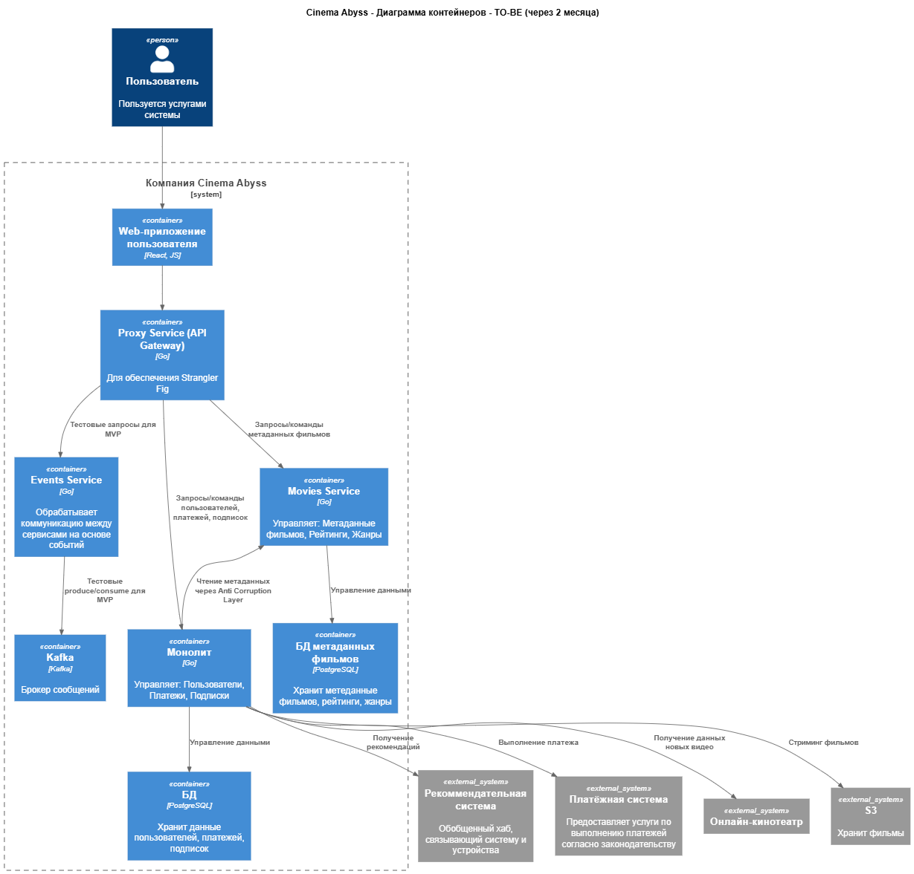

[PUML: Cinema Abyss - Диаграмма контейнеров - TO-BE (через 2 месяца)](./arch/to-be-container.puml)


## Задание 2

Proxy и events сервисы написаны на языке golang.

В docker-compose.yml добавлены healthcheck для kafka и зависимости для kafka и БД (service_healthy) для сервисов monolith и movies-service, иначе они запускались слишком рано и падали.

**Результаты выполнения тестов**

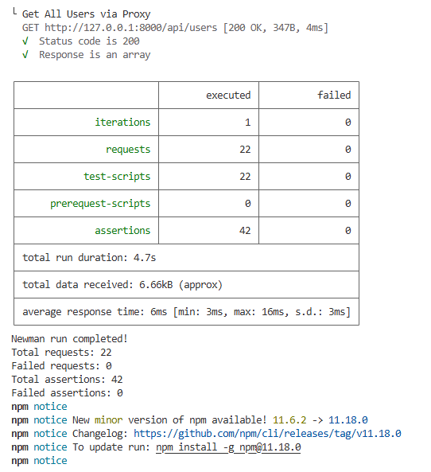

**Результаты запросов curl**

```
MAXIM@LAPTOP-123 MINGW64 /
$ curl http://localhost:8000/api/movies
  % Total    % Received % Xferd  Average Speed   Time    Time     Time  Current
                                 Dload  Upload   Total   Spent    Left  Speed
100  1566  100  1566    0     0   194k      0 --:--:-- --:--:-- --:--:--  218k[{"id":1,"title":"The Shawshank Redemption","description":"Two imprisoned men bond over a number of years, finding solace and eventual redemption through acts of common decency.","genres":["Drama"],"rating":9.3},{"id":2,"title":"The Godfather","description":"The aging patriarch of an organized crime dynasty transfers control of his clandestine empire to his reluctant son.","genres":["Crime","Drama"],"rating":9.2},{"id":3,"title":"The Dark Knight","description":"When the menace known as the Joker wreaks havoc and chaos on the people of Gotham, Batman must accept one of the greatest psychological and physical tests of his ability to fight injustice.","genres":["Action","Crime","Drama"],"rating":9},{"id":4,"title":"Pulp Fiction","description":"The lives of two mob hitmen, a boxer, a gangster and his wife, and a pair of diner bandits intertwine in four tales of violence and redemption.","genres":["Crime","Drama"],"rating":8.9},{"id":5,"title":"Forrest Gump","description":"The presidencies of Kennedy and Johnson, the Vietnam War, the Watergate scandal and other historical events unfold from the perspective of an Alabama man with an IQ of 75, whose only desire is to be reunited with his childhood sweetheart.","genres":["Drama","Romance"],"rating":8.8},{"id":6,"title":"Test Movie 496","description":"A test movie created by automated tests","genres":["Action","Drama"],"rating":4.5},{"id":7,"title":"Microservice Test Movie 769","description":"A test movie created by automated tests for the microservice","genres":["Sci-Fi","Thriller"],"rating":4.8}]


MAXIM@LAPTOP-123 MINGW64 /
$ curl http://localhost:8000/api/users
  % Total    % Received % Xferd  Average Speed   Time    Time     Time  Current
                                 Dload  Upload   Total   Spent    Left  Speed
100   238  100   238    0     0  12936      0 --:--:-- --:--:-- --:--:-- 13222[{"id":1,"username":"user1","email":"user1@example.com"},{"id":2,"username":"user2","email":"user2@example.com"},{"id":3,"username":"user3","email":"user3@example.com"},{"id":4,"username":"testuser703","email":"testuser379@example.com"}]


MAXIM@LAPTOP-123 MINGW64 /
$ curl http://localhost:8000/health
  % Total    % Received % Xferd  Average Speed   Time    Time     Time  Current
                                 Dload  Upload   Total   Spent    Left  Speed
100    30  100    30    0     0   8145      0 --:--:-- --:--:-- --:--:-- 10000Strangler Fig Proxy is healthy

```

**Логи docker для случая MOVIES_MIGRATION_PERCENT: "90"**

```
cinemaabyss-kafka-ui        | 2026-07-16 19:52:02,298 DEBUG [parallel-5] c.p.k.u.s.ClustersStatisticsScheduler: Metrics updated for cluster: cinemaabyss
cinemaabyss-proxy-service   | 2026/07/16 19:52:10 GET /api/movies from 172.21.0.1:46384
cinemaabyss-movies-service  | get movies from movies
cinemaabyss-proxy-service   | 2026/07/16 19:52:11 GET /api/movies from 172.21.0.1:46384
cinemaabyss-movies-service  | get movies from movies
cinemaabyss-proxy-service   | 2026/07/16 19:52:12 GET /api/movies from 172.21.0.1:46384
cinemaabyss-movies-service  | get movies from movies
cinemaabyss-proxy-service   | 2026/07/16 19:52:12 GET /api/movies from 172.21.0.1:46384
cinemaabyss-movies-service  | get movies from movies
cinemaabyss-proxy-service   | 2026/07/16 19:52:13 GET /api/movies from 172.21.0.1:46384
cinemaabyss-movies-service  | get movies from movies
cinemaabyss-proxy-service   | 2026/07/16 19:52:14 GET /api/movies from 172.21.0.1:46384
cinemaabyss-movies-service  | get movies from movies
cinemaabyss-proxy-service   | 2026/07/16 19:52:15 GET /api/movies from 172.21.0.1:46384
cinemaabyss-monolith        | get movies from monolith
cinemaabyss-proxy-service   | 2026/07/16 19:52:15 GET /api/movies from 172.21.0.1:46384
cinemaabyss-movies-service  | get movies from movies
cinemaabyss-proxy-service   | 2026/07/16 19:52:16 GET /api/movies from 172.21.0.1:46384
cinemaabyss-movies-service  | get movies from movies
cinemaabyss-proxy-service   | 2026/07/16 19:52:17 GET /api/movies from 172.21.0.1:46384
cinemaabyss-monolith        | get movies from monolith
cinemaabyss-proxy-service   | 2026/07/16 19:52:18 GET /api/movies from 172.21.0.1:46384
cinemaabyss-movies-service  | get movies from movies
cinemaabyss-proxy-service   | 2026/07/16 19:52:18 GET /api/movies from 172.21.0.1:46384
cinemaabyss-movies-service  | get movies from movies
cinemaabyss-proxy-service   | 2026/07/16 19:52:19 GET /api/movies from 172.21.0.1:46384
cinemaabyss-movies-service  | get movies from movies
cinemaabyss-proxy-service   | 2026/07/16 19:52:20 GET /api/movies from 172.21.0.1:46384
cinemaabyss-movies-service  | get movies from movies
```

**Скрины из Kafka UI**

Топики:

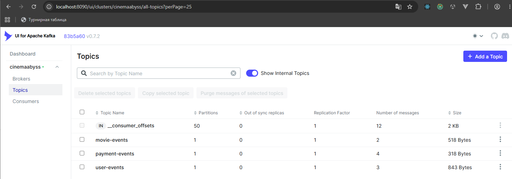

Топик movie-events:

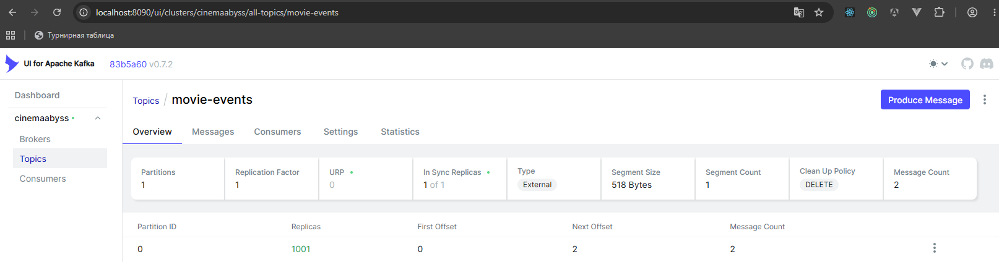

Топик user-events:

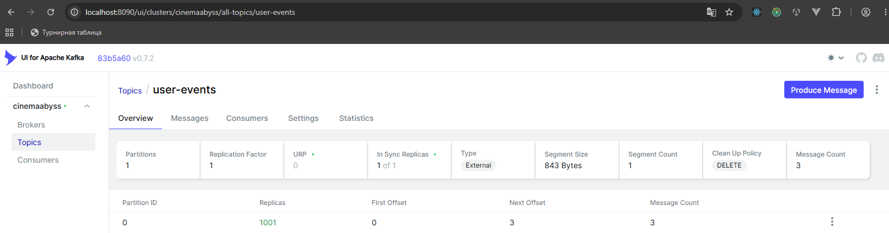

Топик user-events - сообщения:

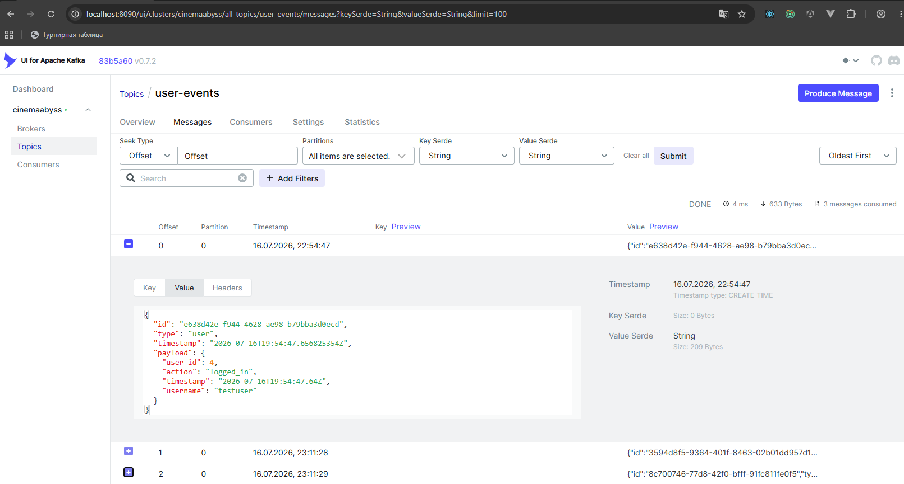

Топик user-events - консьюмер:

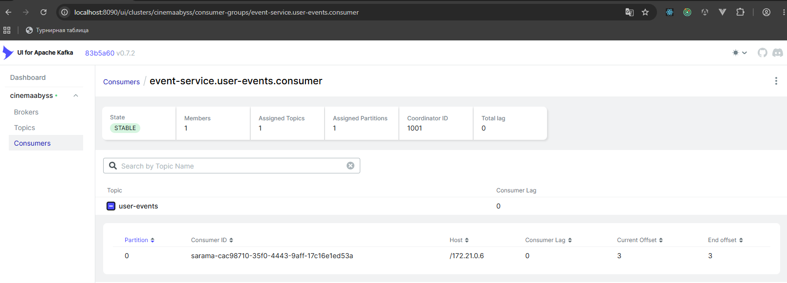

Топик payment-events:

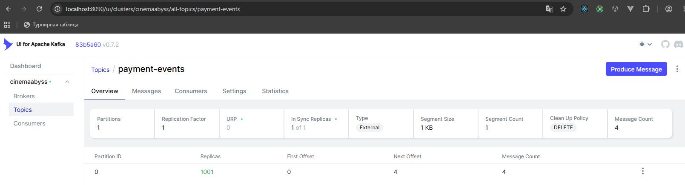

Консьюмеры:

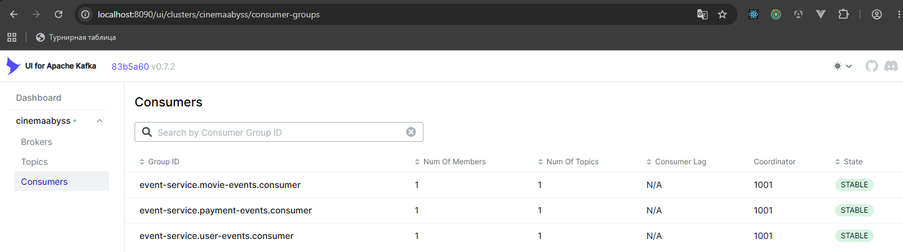


## Задание 3

### CI/CD

**Скриншот сборки**

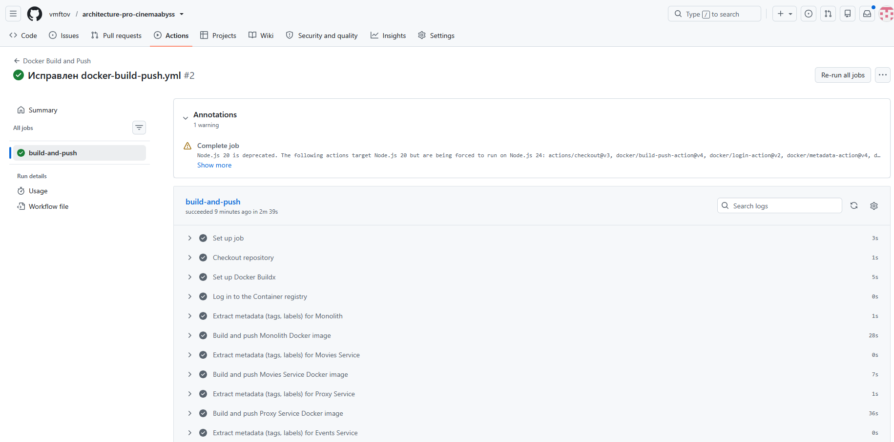

**Скриншот тестов**

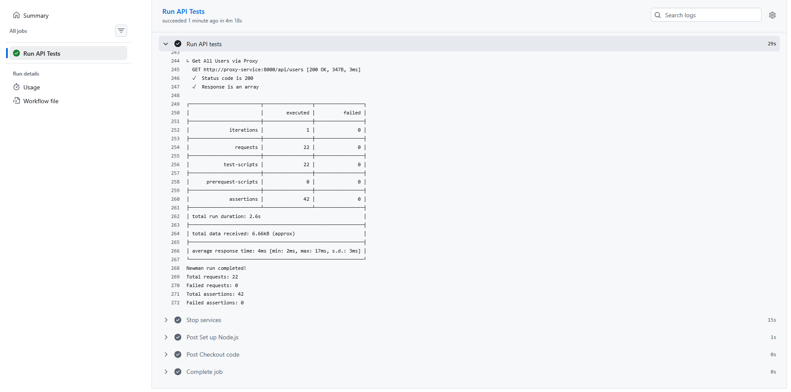

### Proxy в Kubernetes

Удалил из ingress.yaml - path: /api/events и все тесты выполнились.

**Скриншот тестов** 

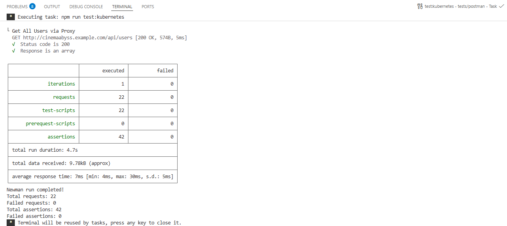

**Логи events-service (kubectl -n cinemaabyss logs events-service-67cdddb99c-9mvd2)**

```
2026/07/17 00:00:27 GET /api/events/health from 10.244.0.1:35348
2026/07/17 00:00:37 GET /api/events/health from 10.244.0.1:53608
2026/07/17 00:00:42 GET /api/events/health from 10.244.0.10:32866
2026/07/17 00:00:42 POST /api/events/movie from 10.244.0.10:32866
Получено сообщение от Kafka: {"id":"5c8dd260-7191-44e2-8f9b-a9f8bd21a7da","type":"movie","timestamp":"2026-07-17T00:00:42.763881482Z","payload":{"action":"viewed","movie_id":12,"title":"Test Movie Event","user_id":7}}
2026/07/17 00:00:42 POST /api/events/user from 10.244.0.10:32866
Получено сообщение от Kafka: {"id":"37989b9e-bc6d-4d0b-8aa3-b747b2f222c5","type":"user","timestamp":"2026-07-17T00:00:42.970061872Z","payload":{"action":"logged_in","timestamp":"2026-07-17T00:00:42.951Z","user_id":7,"username":"testuser"}}
2026/07/17 00:00:43 POST /api/events/payment from 10.244.0.10:32866
Получено сообщение от Kafka: {"id":"e994e876-22b2-4fb5-a170-dfe3053bd829","type":"payment","timestamp":"2026-07-17T00:00:43.191918769Z","payload":{"amount":9.99,"method_type":"credit_card","payment_id":7,"status":"completed","timestamp":"2026-07-17T00:00:43.173Z","user_id":7}}
2026/07/17 00:00:46 GET /api/events/health from 10.244.0.1:40894
2026/07/17 00:00:47 GET /api/events/health from 10.244.0.1:40900
2026/07/17 00:00:57 GET /api/events/health from 10.244.0.1:40220
```

**Скриншот вывода при вызове https://cinemaabyss.example.com/api/movies после выполнения тестов**

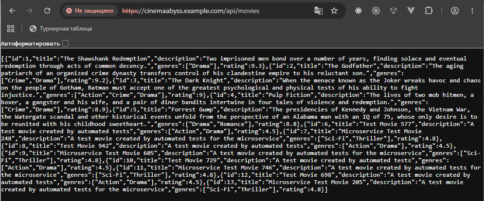

## Задание 4

**Скриншот развертывания helm**

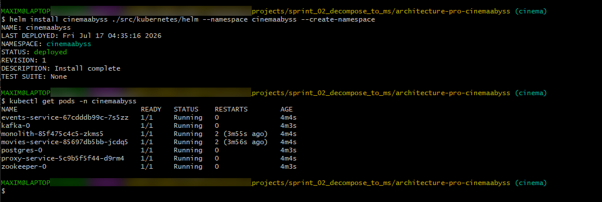

**Скриншот статуса релиза**

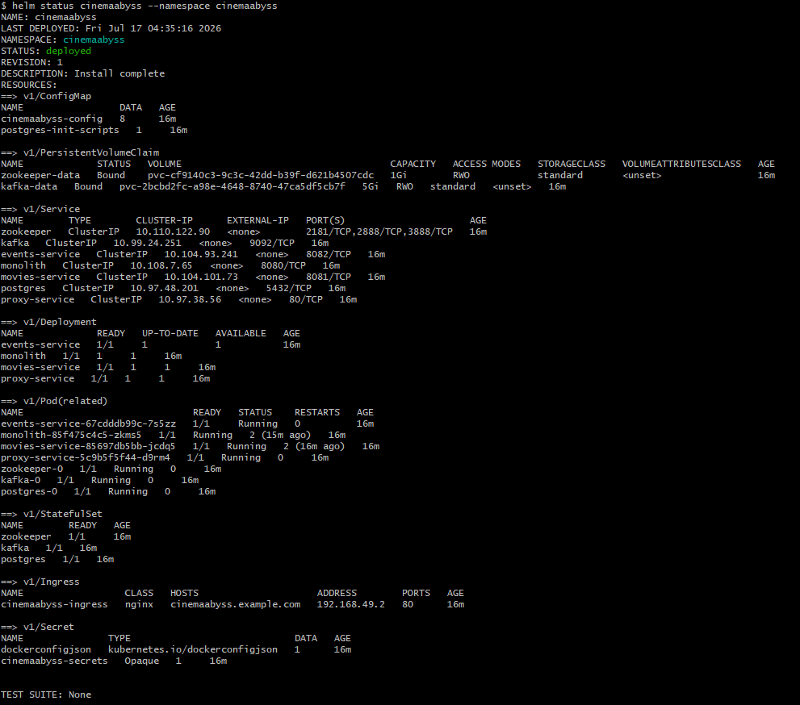

**Скриншот вывода https://cinemaabyss.example.com/api/movies**

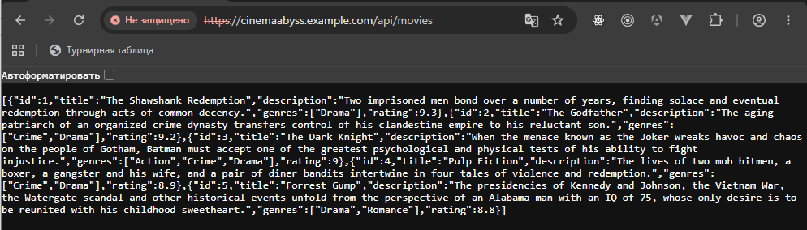

# Задание 5
Компания планирует активно развиваться и для повышения надежности, безопасности, реализации сетевых паттернов типа Circuit Breaker и канареечного деплоя вам как архитектору необходимо развернуть istio и настроить circuit breaker для monolith и movies сервисов.

```bash

helm repo add istio https://istio-release.storage.googleapis.com/charts
helm repo update

helm install istio-base istio/base -n istio-system --set defaultRevision=default --create-namespace
helm install istio-ingressgateway istio/gateway -n istio-system
helm install istiod istio/istiod -n istio-system --wait

helm install cinemaabyss .\src\kubernetes\helm --namespace cinemaabyss --create-namespace

kubectl label namespace cinemaabyss istio-injection=enabled --overwrite

kubectl get namespace -L istio-injection

kubectl apply -f .\src\kubernetes\circuit-breaker-config.yaml -n cinemaabyss

```

Тестирование

# fortio
```bash
kubectl apply -f https://raw.githubusercontent.com/istio/istio/release-1.25/samples/httpbin/sample-client/fortio-deploy.yaml -n cinemaabyss
```

# Get the fortio pod name
```bash
FORTIO_POD=$(kubectl get pod -n cinemaabyss | grep fortio | awk '{print $1}')

kubectl exec -n cinemaabyss $FORTIO_POD -c fortio -- fortio load -c 50 -qps 0 -n 500 -loglevel Warning http://movies-service:8081/api/movies
```
Например,

```bash
kubectl exec -n cinemaabyss fortio-deploy-b6757cbbb-7c9qg  -c fortio -- fortio load -c 50 -qps 0 -n 500 -loglevel Warning http://movies-service:8081/api/movies
```

Вывод будет типа такого

```bash
IP addresses distribution:
10.106.113.46:8081: 421
Code 200 : 79 (15.8 %)
Code 500 : 22 (4.4 %)
Code 503 : 399 (79.8 %)
```
Можно еще проверить статистику

```bash
kubectl exec -n cinemaabyss fortio-deploy-b6757cbbb-7c9qg -c istio-proxy -- pilot-agent request GET stats | grep movies-service | grep pending
```

И там смотрим 

```bash
cluster.outbound|8081||movies-service.cinemaabyss.svc.cluster.local;.upstream_rq_pending_total: 311 - столько раз срабатывал circuit breaker
You can see 21 for the upstream_rq_pending_overflow value which means 21 calls so far have been flagged for circuit breaking.
```

Приложите скриншот работы circuit breaker'а

Удаляем все
```bash
istioctl uninstall --purge
kubectl delete namespace istio-system
kubectl delete all --all -n cinemaabyss
kubectl delete namespace cinemaabyss
```
